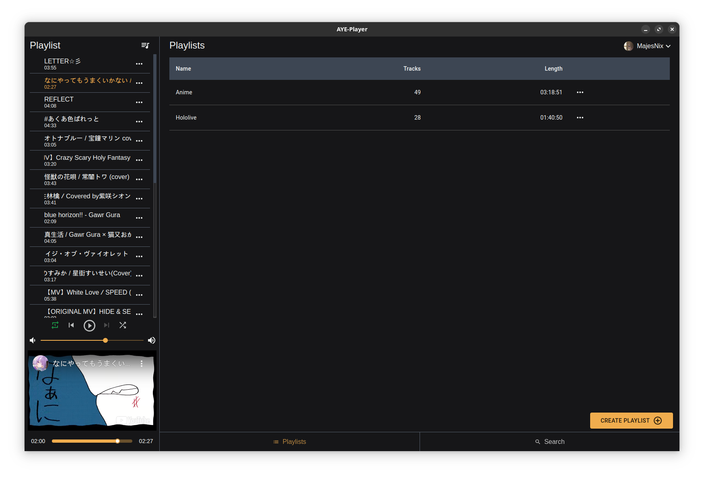

# Aye Player

## Feature Ideas (or already available)

- Electron basierter YouTube Musik Player ✓
- React, TypeScript, MobX-Keystone ✓
- i18n ✓
- Features
  - Sync für Likes und Playlists
  - Discord RPC ✓
    - Is listening to XXX on AYE Player ✓
    - Listen on YouTube Knopf - TODO

