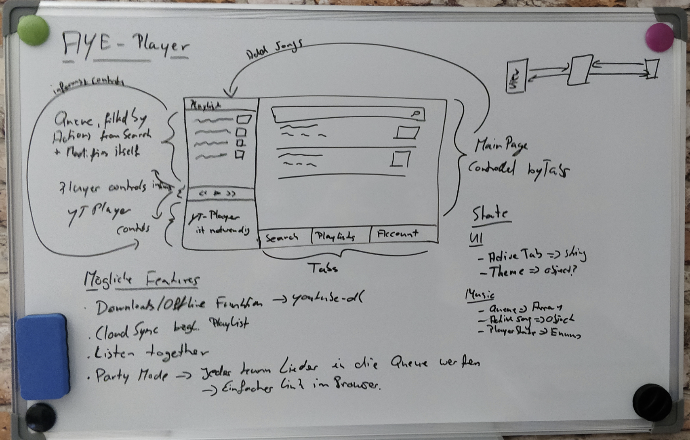

# Aye Player

> “The computer was born to solve problems that did not exist before.”
> — Bill Gates

## Feature Ideen

- Electron basierter YouTube Musik Player
- React, TypeScript, MobX-Keystone
- i18n
- Features

  - Downloads / Offline Funktion --> youtube-dl Integration
  - Cloud Sync für Likes und Playlists ✓
  - Listen together --> Zwei Leute hören gemeinsam Songs / Playlists
  - Party Mode --> Jeder kann Lieder in die Queue einpflegen.
    Zugriffsmöglichkeit über einfachen HTTP Link / Aye Player Mobile App.
  - DJ Mode --> Ein DJ "mixt" Musik aus dem riesigen YT Fundus zusammen und erstellt somit einen DJ Room. Andere User können diesen finden und sich anhören. Der DJ hat hier die alleinge kontrolle als Abgrenzung zum Party Mode.
  - Anschluss an Discord RPC ✓
    - Is listening to XXX on AYE Player ✓
    - Listen on YouTube Knopf
  - Ui Kit --> [Material UI Kit](https://material-ui.com/) ✓
  - Vernünftige Settings ✓
  - Dark Mode ✓

- Backend
  - TypeScript/Node.JS
  - Docker mit pm2 ✓
  - VPS bei [netcup](https://netcup.de) ✓
  - Microservice Architektur ✓
    - Authentication Service ✓
    - Sync Service ✓
    - Party-Mode Service
    - Listen-Together Service
      - Listen-Together-API mit Dokumentation (Ablaufdiagramme)

